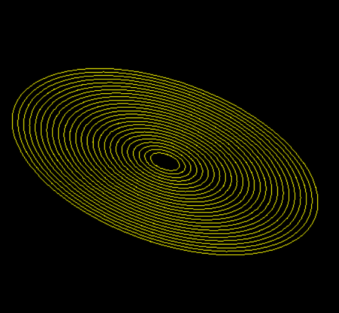

# Fingerprint Pattern Generator

This repository contains two simple Python programs that generate fingerprint-like patterns.

## Files

- `fingerprint1.py` - first fingerprint pattern generator
- `fingerprint2.py` - second fingerprint pattern generator

## Preview

### fingerprint1



### fingerprint2


## Usage

Run one of the Python scripts with Python 3:

```powershell
python fingerprint1.py
python fingerprint2.py
```

Each script generates a fingerprint-style image.
